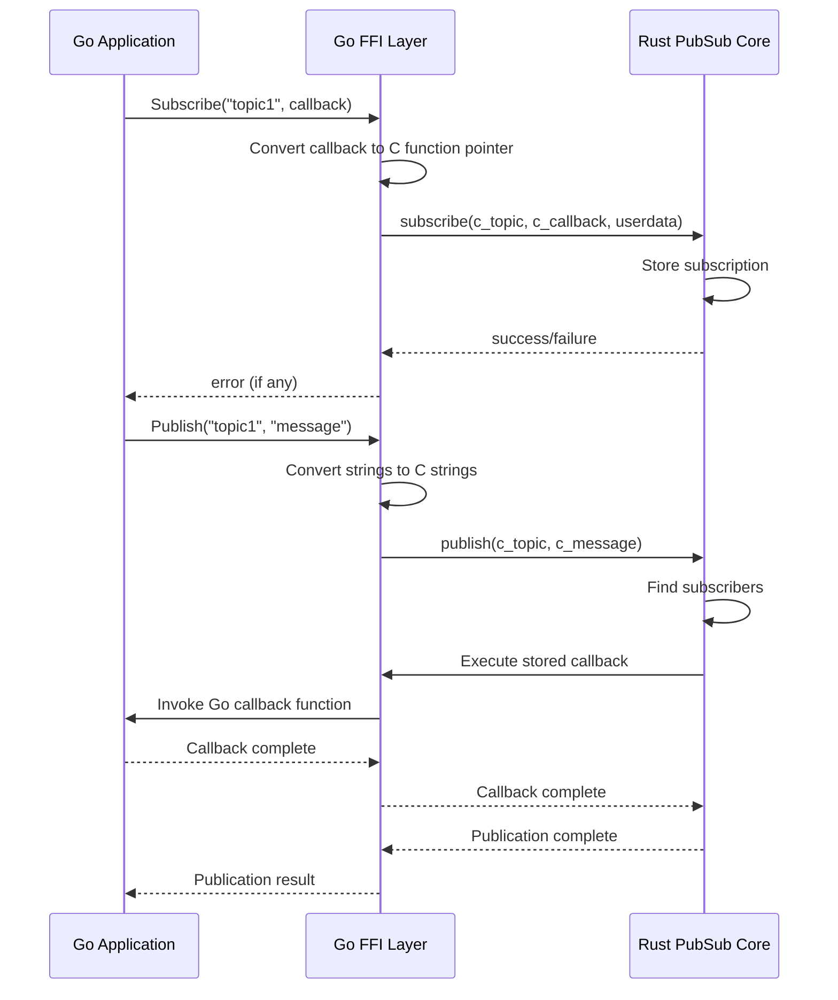

# Go-Rust FFI Architecture

This document explains the interaction between a Go application and the Rust-based PubSub system through FFI (Foreign Function Interface).

## Overview

The system consists of three main components:
1. Go Application - The consumer of the PubSub system
2. Go FFI Layer - The bridge between Go and Rust
3. Rust PubSub Implementation - The core PubSub functionality

## Component Interaction

The interaction between components follows these general patterns:

1. **Subscription Flow**:
   - Go application calls the FFI layer to subscribe to a topic
   - FFI layer converts Go types to C types
   - Rust receives the subscription request and stores callback information
   - Rust returns success/failure through the FFI layer

2. **Publication Flow**:
   - Go application publishes a message through the FFI layer
   - FFI layer converts the message and topic to C strings
   - Rust processes the publication and triggers stored callbacks
   - Callbacks are executed, crossing back through FFI to Go

## Sequence Diagram

## Memory Management

### Go Side
- Go strings are converted to C strings using `C.CString()`
- C strings must be freed using `C.free()`
- Callbacks are wrapped to ensure proper Go pointer handling
- User data is managed through the cgo pointer registry

### Rust Side
- C strings are converted to Rust strings using `CStr`
- Memory is managed using Rust's ownership system
- Raw pointers (`*mut c_void`) are wrapped in thread-safe types
- Callbacks are stored in thread-safe containers

## Thread Safety

1. **Rust Implementation**:
   - Uses `Mutex` for thread-safe state management
   - Wraps unsafe raw pointers in thread-safe types
   - Ensures `Send` and `Sync` traits are implemented

2. **Go Implementation**:
   - Handles callback registration thread-safely
   - Uses proper synchronization for C calls
   - Maintains thread-local storage when required

## Error Handling

1. **Rust to Go**:
   - Rust errors are converted to boolean return values
   - Detailed error information is simplified for FFI boundary

2. **Go to Application**:
   - FFI errors are wrapped in Go error types
   - Context is added to error messages
   - Resource cleanup is handled automatically

## Performance Considerations

1. **Memory Copies**:
   - String conversions require memory copies
   - Large messages may impact performance
   - Consider using shared memory for large data

2. **Callback Overhead**:
   - FFI calls have additional overhead
   - Batch operations when possible
   - Use message queuing for high-frequency events

## Usage Guidelines

1. **Resource Management**:
   - Always unsubscribe when done
   - Free C strings after use
   - Handle cleanup in defer statements

2. **Error Handling**:
   - Check return values from FFI calls
   - Implement proper error recovery
   - Log FFI-related errors for debugging

3. **Threading**:
   - Don't share FFI objects between threads
   - Use proper synchronization
   - Be aware of callback context
